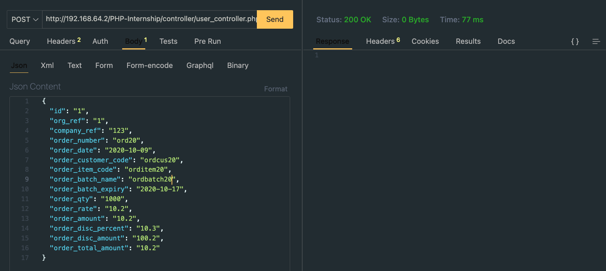

# Documentation

## Folder Structure

### Controller

- It contains user_controller.php
- The code inside user_controller works based on the requested url
- It contains two cases one for inserting data and one for showing data
- Based on these two cases the model file is invoked and corresponding business logic is executed

### Model

- It contains the logic for the requested URL
- For example
    - when the url is [`http://192.168.64.2/PHP-Internship/controller/user_controller.php?operations=insert`](http://192.168.64.2/PHP-Internship/controller/user_controller.php?operations=insert)
    - It will execute the corresponding model logic that is `add_org_data()`
    - JSON tested image
        
        
        

### Frontend

